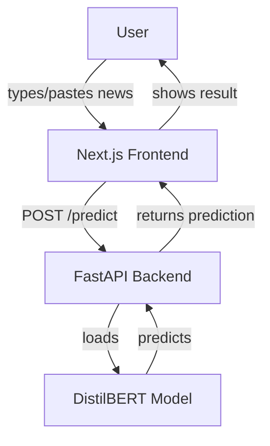

# TrustNet AI: Fake News Detection Web App

TrustNet AI is an open-source, AI-powered web application that detects whether a news article or headline is real or fake using state-of-the-art Natural Language Processing (NLP) and deep learning. Built with Next.js (frontend) and FastAPI (backend), it leverages a fine-tuned DistilBERT model trained on the FakeNewsNet dataset.

---

## 🚀 Features

- Paste any news article or headline to check its authenticity
- Real-time AI predictions with confidence scores
- Modern, responsive UI (Next.js + shadcn/ui)
- Open source and privacy-friendly (no input stored)

---

## 🏗️ Architecture



- **Frontend:** Next.js (React), shadcn/ui, fetches predictions from backend
- **Backend:** FastAPI, loads trained DistilBERT model, exposes `/predict` API
- **Model:** DistilBERT fine-tuned on FakeNewsNet (PolitiFact & GossipCop)

---

## 🛠️ Tech Stack

- **Frontend:** Next.js 13+, React, shadcn/ui, TypeScript
- **Backend:** FastAPI, Python, Hugging Face Transformers, PyTorch
- **Model:** DistilBERT (fine-tuned)
- **Dataset:** [FakeNewsNet](https://github.com/KaiDMML/FakeNewsNet)

---

## ⚙️ How It Works

1. **Input:** User pastes a news headline or article.
2. **AI Analysis:** Backend uses a fine-tuned DistilBERT model to analyze the text.
3. **Prediction:** Model returns "real" or "fake" with a confidence score.
4. **Result:** User sees the result instantly in the UI.

---

## 🧑‍💻 Local Development

### 1. Clone the repository

```bash
git clone https://github.com/your-repo/trustnet-ai.git
cd trustnet-ai
```

### 2. Backend Setup

- Go to the backend folder:
  ```bash
  cd backend
  ```
- Install dependencies:
  ```bash
  pip install -r requirements.txt
  ```
- (Optional) Download and preprocess the FakeNewsNet dataset (see `preprocess_fakenewsnet.py`).
- Train the model:
  ```bash
  python train_model.py
  ```
- Start the FastAPI server:
  ```bash
  uvicorn app:app --reload
  ```
  The API will be available at `http://127.0.0.1:8000/predict`.

### 3. Frontend Setup

- Go to the frontend folder:
  ```bash
  cd ../frontend
  ```
- Install dependencies:
  ```bash
  npm install
  # or
  yarn install
  ```
- Start the Next.js dev server:
  ```bash
  npm run dev
  # or
  yarn dev
  ```
- Open [http://localhost:3000](http://localhost:3000) in your browser.

---

## 📝 Usage

- Paste a news article or headline in the input box.
- Click **Check Authenticity**.
- View the prediction and confidence score.

---

## 🌐 Deployment

- **Frontend:** Deploy to [Vercel](https://vercel.com/) (free tier)
- **Backend:** Deploy to [Hugging Face Spaces](https://huggingface.co/spaces) or [Render](https://render.com/)
- Update the frontend API URL to point to your deployed backend.

---

## 📂 Project Structure

```
trustnet-ai/
├── backend/
│   ├── app.py              # FastAPI backend
│   ├── train_model.py      # Model training script
│   ├── preprocess_fakenewsnet.py # Data preprocessing
│   ├── fakenews_model/     # Saved model & tokenizer
│   └── requirements.txt
├── frontend/
│   ├── app/                # Next.js app directory
│   ├── components/         # UI components
│   └── ...
└── README.md
```

---

## 🤝 Contributing

Pull requests and issues are welcome! See [CONTRIBUTING.md](CONTRIBUTING.md) for guidelines.

---

## 📜 License

MIT License. See [LICENSE](LICENSE) for details.

---

## 🙏 Acknowledgements

- [FakeNewsNet Dataset](https://github.com/KaiDMML/FakeNewsNet)
- [Hugging Face Transformers](https://huggingface.co/transformers/)
- [shadcn/ui](https://ui.shadcn.com/)
- [Next.js](https://nextjs.org/)
- [FastAPI](https://fastapi.tiangolo.com/)
